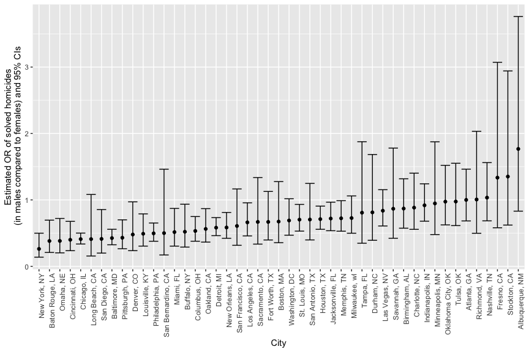

p8105_hw6_ksf2129
================
Kimia Faroughi
2025-12-02

Load packages

``` r
library(tidyverse)
```

## Problem 1

Read in the data

``` r
homicides_df = 
  read_csv("data/homicide-data.csv")
```

Clean data and create variables

``` r
homicides_df =
  homicides_df |> 
  #create city_state var, binary var whether homicide is solved, convert age to numeric
  mutate(
    city_state = str_c(city, state, sep = ", "),
    solved = case_when(
      disposition == "Closed without arrest" ~ "unsolved",
      disposition == "Open/No arrest" ~ "unsolved",
      TRUE ~ "solved"
    ),
    victim_age = as.numeric(victim_age)
  ) |> 
  filter(city_state != "Tulsa, AL", 
         city_state != "Dallas, TX", 
         city_state != "Phoenix, AZ", 
         city_state != "Kansas City, MO",
         victim_race == "White" | victim_race == "Black")
```

Fit logistic regression model for Baltimore

``` r
#create dataset with just Baltimore, MD
baltimore_df = 
  homicides_df |> 
  filter(city_state == "Baltimore, MD") |> 
  mutate(
    solved = factor(solved, levels = c("unsolved", "solved")) #convert outcome to factor, with unsolved as the reference
  )
  
fit_baltimore = glm(solved ~ victim_age + victim_sex + victim_race, data = baltimore_df, family = binomial())
```

Clean up output

``` r
fit_baltimore |> 
  broom::tidy() |> 
  filter(term == "victim_sexMale") |> 
  mutate(
    OR = exp(estimate),
    lower_CI = exp(estimate - (1.96*std.error)),
    upper_CI = exp(estimate + (1.96*std.error)),
    term = str_replace(term, "victim_sex", "Victim Sex: ")
    ) |>
  select(term, OR, lower_CI, upper_CI) |> 
  knitr::kable(digits = 3)
```

| term             |    OR | lower_CI | upper_CI |
|:-----------------|------:|---------:|---------:|
| Victim Sex: Male | 0.426 |    0.325 |    0.558 |

Do this for all cities

``` r
#turn outcome into factor var
homicides_df = 
  homicides_df |> 
  mutate(
    solved = factor(solved, levels = c("unsolved", "solved")) #convert outcome to factor, with unsolved as the reference
  )

#fit regression model to each city
fit_allcities =
  homicides_df |> 
  nest(data = -city_state) |> 
  mutate(
    fits = map(data, \(df) glm(solved ~ victim_age + victim_sex + victim_race, data = df, family = binomial())),
    glm_results = map(fits, broom::tidy)
  ) |> 
  select(city_state, glm_results) |> 
  unnest(glm_results)

#create df with OR and CI for each city
all_cities = 
  fit_allcities |> 
    filter(term == "victim_sexMale") |> 
    mutate(
      OR = exp(estimate),
      lower_CI = exp(estimate - (1.96*std.error)),
      upper_CI = exp(estimate + (1.96*std.error))
      ) |>
    select(city_state, OR, lower_CI, upper_CI)
```

Plot estimated ORs and CIs for each city

``` r
all_cities |> 
  mutate(
    city_state = fct_reorder(city_state, OR)
  ) |> 
  ggplot(aes(x = city_state, y = OR)) +
  geom_point() +
  geom_errorbar(aes(ymin = lower_CI, ymax = upper_CI)) +
  theme(axis.text.x = element_text(angle = 90, hjust = 1, vjust = 1)) +
  labs(
      x = "City",
      y = "Estimated OR of solved homicides\n (in males compared to females) and 95% CIs",
    ) 
```

<!-- -->

This plot shows that many of the cities’ estimates of the odds of a
solved homicide is smaller if the victim is male compared to if the
victim is female, since many of the estimated ORs are less than 1.
However, some of these ORs have a corresponding 95% CI that includes the
null value 1, such as Long Beach, San Bernardino, San Francisco,
Sacramento, etc. This means that the apparent observation that males
have a lower odds of solved homicides compared to females in such
cities, using a 5% significance level and adjusting for victim age and
race, can be ruled out due to chance. The same is true for all estimated
ORs that are greater than 1 (Nashville, Fresno, Stockton, and
Albuquerque), whose point estimates show that males have higher odds of
a solved homicide compared to females, but the 95% CI includes the null
value 1. Oklahoma City, Tulsa, Atlanta, and Richmond have an OR
approximately equal to 1, indicating that the odds of a solved homicide
is about the same for males compared to females. Finally, cities such as
New York, Baton Rouge, Omaha, Cincinnati, Chicago, etc. have an estimate
OR \< 1 with the 95% CIs contained less than 1 as well, meaning the
observation that the estimated odds of a solved homicide is smaller in
males compared to females cannot be ruled out due to random chance,
using a significance level of 5%, adjusting for victim age and race.
